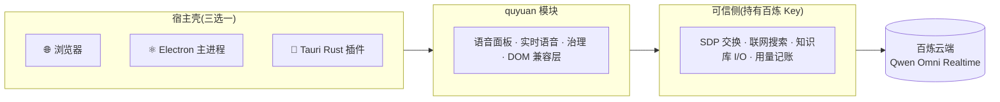

<div align="center">

# 🧞 屈原 QuYuan

**可移植语音人格运行时 · 实时语音 / 本地知识库 / 治理内建**

*A portable voice-persona runtime extracted from TALOS — realtime voice, local knowledge tools, governance built-in.*

[](https://github.com/hsiwf/quyuan/releases)


[](./LICENSE)

[路线 A · 浏览器](#-快速开始) · [路线 B · Electron](#b--electron-桌面应用推荐) · [路线 C · Tauri](#c--tauri-桌面应用) · [场景推荐](#-三条路线怎么选) · [嵌入指南](#-嵌入指南二次开发)

</div>

---

> [!IMPORTANT]
> 本项目是对 [TALOS for Obsidian](https://github.com/WAINAO-Haaper/talos-plugin)(作者 [@WAINAO-Haaper](https://github.com/WAINAO-Haaper))的修改版再分发,依据 [LICENSE](./LICENSE) 第 2 条面向**个人非商业用途**。商用需按第 3 条获得版权人书面授权。详见 [📄 许可与出处](#-许可与出处)。

## ✨ 特性

- 🗣️ **Qwen Omni Realtime 实时语音** —— WebRTC 直连,11 态状态机,唤醒词门控(说「屈原」唤醒)、声控打断
- 🎧 **本地语音链** —— Silero VAD + sherpa-onnx 中英双语流式 ASR,固定资产 + SHA-256 校验,失败关闭
- 📚 **知识库只读工具** —— glob / read / grep / search 四件套,指向任意本地文件夹即可问答
- 🔐 **治理内建** —— 语音硬只读、联网搜索需当前轮口令、库内容按不可信数据处理、密钥只留可信宿主侧
- 🧩 **宿主端口化** —— 存储 / 通知 / Markdown / Agent 工作台全部是端口,嵌入任意 Web 前端只差几个函数
- 🧞‍♂️ **TalosBall 动画舞台** —— 32 态确定性动画 + 粒子磁场,Canvas 实现,无 React/Three.js

## 📦 仓库结构

```
quyuan/
├── src/                  # 🧞 屈原可移植模块(纯 TS,零运行时依赖)
│   ├── host/             #    宿主端口:文本存储 / UI / Agent 工作台 / DOM 兼容层 / 图标
│   ├── vendor/           #    随迁的 TALOS 纯文件与第三方资产
│   └── ...               #    语音面板 · 实时语音 · 治理 · 人格 · 会话存储
├── apps/
│   ├── quyuan-poc/       # 🌐 路线 A · 浏览器 POC(Node 可信侧服务 + 网页)
│   ├── quyuan-app/       # ⚛️  路线 B · Electron 桌面应用
│   └── quyuan-tauri/     # 🦀  路线 C · Tauri 2 桌面应用
└── styles/               # 屈原工作台样式(shell + 宿主 chrome)
```

## 🚀 快速开始

> [!TIP]
> 三条路线共用同一份配置格式与同一套百炼凭证,可随时互换。

**① 准备凭证**(三条路线通用)

1. [阿里云百炼](https://bailian.console.aliyun.com) 创建 API-KEY(`sk-` 开头)
2. 控制台「业务空间」页复制业务空间 ID
3. (可选)准备一个放 Markdown 笔记的文件夹作为**屈原告知识库**

**② A · 浏览器 POC** —— 零桌面依赖,先跑通链路

```bash
cd apps/quyuan-poc
npm install
npm run dev        # 可信侧服务(8787)+ Vite(5188)
```

浏览器打开 `http://localhost:5188`,右上角 ⚙ 填入凭证 → 点「开启语音」。

**③ B · Electron 桌面应用** —— 日常自用推荐

```bash
cd apps/quyuan-app
npm install        # 国内网络保留 .npmrc(electron 镜像)
npm start          # 构建并打开桌面窗口
```

**④ C · Tauri 桌面应用** —— 轻量分发

```bash
cd apps/quyuan-tauri
npm install
npm run build                              # 前端 dist(exe 内嵌)
cd src-tauri && cmd //c _vsrelease.cmd     # 编译正式版(Git Bash 必须走 vcvars)
./target/release/quyuan-tauri.exe          # 独立运行,无需任何服务器
```

**⑤ 语音玩法**(三条路线一致)

| 你说 | 发生什么 |
|---|---|
| 「屈原」 | 唤醒,30 秒内连续对话;「退下」休眠;「退出语音」关麦 |
| 「现在几点了?」 | 走文字/语音大脑直接回答 |
| 「知识库里有哪些文件?」 | 调用库内只读工具,扫描你的知识库目录 |
| 「**联网搜索**一下今天的新闻」 | 带口令才真正出网(安全设计,每轮限一次) |

文字输入框始终可用,与语音共享治理规则。

## 🧭 三条路线怎么选

| 场景 | 推荐 | 理由 |
|---|---|---|
| 日常自用、追求稳定 | **B · Electron** | 系统级音频/麦克风最可靠;原生目录选择;UserData 隔离配置 |
| 在意体积、想分发 | **C · Tauri** | 安装包小一个量级;Rust 能力清单白名单网络域;需 Rust 工具链 |
| 快速验证、二次开发参考 | **A · 浏览器 POC** | 零桌面依赖,半天看懂全部接线;改动即时生效 |

三条路线共用同一份页面装配代码(`apps/*/src/main.ts`)与同一套宿主端口,迁移只需换桥接实现。

## 🏗️ 架构



- 实时语音的**媒体流**在浏览器与百炼之间直连,服务端只交换信令
- 密钥边界:Key 只存在可信宿主侧,模块源码不持有、不传输——合同测试钉死

## 🔌 嵌入指南(二次开发)

把本仓库当 npm 包用(`apps/` 内部即通过 `file:../..` 引用):

```bash
npm install    # 根目录;prepare 脚本自动构建 dist
```

**1️⃣ 安装 DOM 兼容层**(必须最先调用——TALOS 的 UI 代码依赖 Obsidian 的原型扩展)

```ts
import { installQuyuanDomExtensions } from "quyuan";

installQuyuanDomExtensions(); // 幂等
```

覆盖 `createEl/createDiv/createSpan`(`cls/text/attr`)、`setText`、`empty`、`addClass/removeClass/toggleClass`(支持空格分隔多类名)、`setCssProps`,以及 `setIcon`(内置 14 个 Lucide 系内联 SVG + talos-logo,`registerQuyuanIcon` 可扩展)。

**2️⃣ 实现宿主端口**

```ts
import {
  QuyuanVoicePanel, InMemoryTextStore, DEFAULT_QUYUAN_SETTINGS,
  type QuyuanHost, type QuyuanVoiceRuntimeHost,
} from "quyuan";
import "quyuan/styles.css";
import "quyuan/styles/workspace-chrome.css";

const host: QuyuanHost = {
  configDir: ".config",                        // 原 Obsidian 的 .obsidian,用于库路径禁区判断
  notify: (msg, timeoutMs) => ui.toast(msg),   // 原 new Notice(...)
  renderMarkdown: async (md, el) => { el.innerHTML = DOMPurify.sanitize(marked.parse(md)); },
  openSettings: () => myApp.openSettings(),    // 可选
};

const runtimeHost: QuyuanVoiceRuntimeHost = {
  getAgentWorkbenchService: () => myAgentService,          // QuyuanAgentWorkbenchService 结构接口
  auditQuyuanProviderEgress: async (input) => myPrivacyAudit(input),
};
```

**3️⃣ 装配语音面板**

```ts
const plugin = {
  ...runtimeHost,
  paths: {},                                   // QuyuanVaultPaths:宿主路径快照
  activateQuyuanV2View: async () => {},        // "转到 AI 对话"导航钩子
  exchangeQuyuanRealtimeSdp: async (input) => trusted.sdp(input),    // 信令必须在可信侧(持百炼 Key)
  executeQuyuanVoiceVaultTool: async (input) => myVaultTools.run(input), // 应路由经 authorizeTool
  executeQuyuanVoiceWebSearch: async (input) => trusted.webSearch(input),// 同上
  recordQuyuanProviderUsage: async (input) => myUsageStore.record(input),
};

const panel = new QuyuanVoicePanel(
  host,                            // ① 宿主 UI 端口(原 Obsidian App 的替代)
  plugin,                          // ② 面板依赖(TalosQuyuanPlugin 接口)
  { ...DEFAULT_QUYUAN_SETTINGS },
  async () => saveSettings(),      // ④ 可选:设置持久化回调
  (pageKey) => router.go(pageKey), // ⑤ 可选:页面导航
);
panel.mount(document.querySelector("#quyuan-root"));
```

> 💡 `apps/*/src/main.ts` 就是三份完整装配实现(各约 400 行),是最好的参考样本。

## 🧰 宿主端口一览

| 端口 | 替代的 Obsidian API | 用途 |
|---|---|---|
| `QuyuanTextStore` | `app.vault.adapter` | 人格三文件加载(exists/read) |
| `QuyuanHostUi.notify` | `Notice` | 轻量通知 |
| `QuyuanHostUi.renderMarkdown` | `MarkdownRenderer.render` | AI 回复的 Markdown 渲染 |
| `QuyuanHostUi.openSettings?` | `app.setting.openTabById` | 打开宿主设置 |
| `QuyuanHostEnv.configDir?` | `app.vault.configDir` | 库路径禁区判断 |
| `QuyuanVoiceRuntimeHost` | `AgentWorkbenchService` + 出库审计 | 双通道 Agent 执行与隐私审计 |
| `TalosQuyuanPlugin`(面板 deps) | 原插件 `main.ts` 桥 | SDP 信令、库内只读工具、联网搜索、用量记账 |

## 📚 vendor 清单(随迁的 TALOS 纯文件)

| 文件 | 出处 |
|---|---|
| `vendor/talos-mark.ts` | `src/talos-mark.ts`(TALOS 标志粒子生成 + talos-logo SVG) |
| `vendor/secret-policy.ts`、`vendor/tool-path-policy.ts` | `src/ai/context/` |
| `vendor/action-types.ts`、`vendor/action-risk-policy.ts` | `src/action-core/` |
| `vendor/provider-capabilities.ts` | `src/ai/provider/types.ts` + `src/ai/privacy/provider-usage-audit-store.ts` 纯类型部分 |
| `vendor/runtime-contracts/` | `src/agent-workbench/contracts/`(agent-events / runtime-adapter / runtime-capabilities) |
| `vendor/voiceio.ts` | `src/jarvis/voiceio.ts`(系统 TTS;WebSpeech STT 保持失败关闭桩) |
| `vendor/local-voice-runtime/`、`src/talos-ball/runtime/vendor/` | 固定版本第三方资产(见 [THIRD-PARTY-NOTICES.md](THIRD-PARTY-NOTICES.md)) |

## 🔍 与上游 TALOS 的有意差异

1. **`App` → 端口**:`persona-context`/`module.ts` 消费 `QuyuanTextStore`;`voice-panel` 消费 `QuyuanHost`,构造签名从 `(app, plugin, …)` 变为 `(host, plugin, …)`
2. **`activeDocument` → `document`**:不再支持 Obsidian 多窗口(逆变弹窗)语义
3. **`VaultPaths` 类 → `QuyuanVaultPaths`**:面板只透传,宿主给任意路径映射对象
4. **排序钉死码点序**:裸 `localeCompare` 的输出顺序随 ICU 环境漂移,统一为 `compareCodepoint`
5. **宿主装配断言移除**:钉在 `view.ts`/`main.ts` 的装配合同归上游仓库;模块内安全/只读/单引擎合同全部保留并适配
6. **测试基建加固**:talos-ball 完整性哈希归一 LF 后比对;pose 等价测试修复 Windows 路径

## ✅ 测试与质量

```bash
npm test        # 18 个文件 / 141 个用例:治理、人格上下文、会话隔离、
                # 只读策略(源码级合同)、Qwen 实时语音、本地语音供应链、
                # TalosBall 完整性 / 姿态等价
npm run build   # dist/:ESM + CJS + 54 个类型声明
```

## 🙏 致谢

- **[TALOS for Obsidian](https://github.com/WAINAO-Haaper/talos-plugin)** —— 屈原告子系统的原产地,[@WAINAO-Haaper](https://github.com/WAINAO-Haaper) 的设计与实现
- [sherpa-onnx](https://github.com/k2-fsa/sherpa-onnx) / [ONNX Runtime](https://onnxruntime.ai) —— 本地语音推理
- [TalosBall](https://github.com/sam70361/emotion-ball)(sam70361) —— 32 态动画舞台
- [Lucide](https://lucide.dev) —— 图标;[marked](https://marked.js.org) / [DOMPurify](https://github.com/cure53/DOMPurify) —— 渲染

完整第三方许可边界见 [THIRD-PARTY-NOTICES.md](THIRD-PARTY-NOTICES.md)。

## 📄 许可与出处

- **上游项目**:TALOS for Obsidian,作者 外脑玩家 Haaper([@WAINAO-Haaper](https://github.com/WAINAO-Haaper))
- **本仓库性质**:对 TALOS Materials 的修改版再分发,依据 [LICENSE](./LICENSE)(TALOS Personal Use Source License 1.0)第 2 条「个人非商业用途」条款:**完整源码公开、原许可与版权声明完整保留、不收取费用、接收方获得不劣于原许可的限制**
- **修改标识**:全部源码相对上游做了结构性适配(去 Obsidian 化端口化,见《与上游 TALOS 的有意差异》)
- 本项目不是 TALOS 官方发布物,**不得**将其声称为自己的原创作品;商用需按 LICENSE 第 3 条向版权人获得书面授权

---

<div align="center">

**如果这个项目对你有帮助,点个 ⭐ 让更多人看到**

</div>
